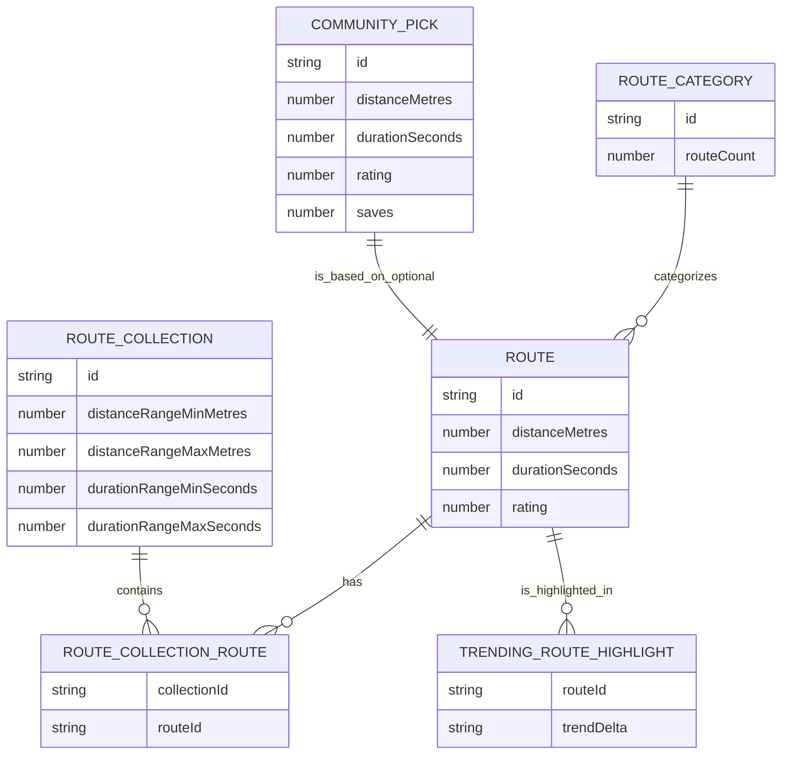
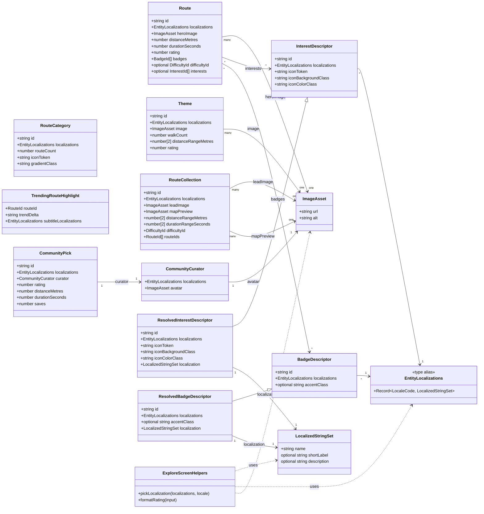

# Data model-driven card architecture

Last updated: 25 November 2025

## Purpose

Every card in the mockup must render from a concrete entity data model that
already contains its localized strings and International System of Units
(SI)-based measurements.
Locale bundles should keep only UI chrome and formatting scaffolding. This
document audits current card usages and defines the schemas, localization
rules, and migration steps to align the codebase.

For a backend-compatible perspective (hexagonal domain boundaries, ports, and
offline-first persistence), see `docs/wildside-mockup-data-model.md`.

## Principles to enforce

- Entity models own their names, descriptions, badges, and imagery per locale.
- Attribute labels come from stable internal identifiers resolved via
  descriptor registries (difficulties, interests, surfaces, tags).
- Numeric values are stored in SI base units; conversion happens at render
  time via the existing unit-format helpers.
- Counts stay as integers; pluralization belongs to the translation system.
- Components receive fully formed entities and only format/present them.

## Card inventory and current data sources

- **Explore screen (`explore-sections.tsx`)**: category chips, featured walk,
  popular theme cards, curated collection cards, trending route cards,
  community pick panel. Data comes from `data/explore.ts`; names/descriptions
  live directly in fixtures (English only).
- **Discover screen (`discover-screen.tsx`)**: interest chips driven by
  `resolveDiscoverInterests` over the interest registry; labels drawn from
  Fluent keys.
- **Customize screen (`customize-sections.tsx`)**: segment toggle cards,
  surface option cards, route preview cards, advanced preference toggle cards.
  Text is currently split between fixtures and Fluent keys.
- **Offline screen (`offline-screen.tsx`)**: offline suggestion cards, offline
  download cards, undo cards, auto-management preference cards; strings are
  hard-coded in `data/stage-four.ts` with some UI copy in Fluent.
- **Safety screen (`safety-accessibility-screen.tsx`)**: accordion sections and
  toggle rows plus preset chips; labels sourced from Fluent keys defined in
  `data/stage-four.ts`.
- **Walk complete screen (`walk-complete-screen.tsx`)**: hero summary card,
  primary and secondary stat cards, favourite moment cards, share chip row;
  entity text held in `data/stage-four.ts`.
- **Saved route screen (`map/saved/saved-screen.tsx`)**: saved route summary
  panel and POI list cards; data from `data/map.ts` with English strings.
- **Wizard step 3 (`wizard/step-three`)**: generated route summary card,
  highlight chips, featured stops list; strings live in `data/wizard.ts` but
  echoed into Fluent defaults.

## Shared model building blocks

Use these primitives across entities:

```ts
export type LocaleCode =
  | "en-GB"
  | "en-US"
  | "fr"
  | "de"
  | "es"
  | "fi"
  | "da"
  | "el"
  | "cy"
  | "ar";

export type LocalizedStringSet = {
  readonly name: string;
  readonly description?: string;
  readonly shortLabel?: string;
};

export type EntityLocalizations = Record<LocaleCode, LocalizedStringSet>;

export type ImageAsset = {
  readonly url: string;
  readonly alt: string;
};
```

Fallback rule: prefer the current user locale, fall back to `en-GB` then any
available locale. Components must not construct names from translation keys.

## Entity schemas by card type

- **Route (featured, trending, saved, wizard routes)**
  - `id: RouteId` (stable slug)
  - `localizations: EntityLocalizations` (name, description)
  - `heroImage: ImageAsset`
  - `distanceMetres: number` (SI)
  - `durationSeconds: number` (SI)
  - `rating: number` (0–5)
  - `badges: string[]` (badge descriptor ids)
  - `difficultyId?: DifficultyId`
  - `interests?: InterestId[]`
- **RouteCollection (curated collection cards)**
  - `id`, `localizations`
  - `leadImage: ImageAsset`
  - `mapPreview: ImageAsset`
  - `distanceRangeMetres: [number, number]`
  - `durationRangeSeconds: [number, number]`
  - `difficultyId: DifficultyId`
  - `routeIds: RouteId[]`
- **RouteCategory (category chips)**
  - `id`
  - `localizations` (name only)
  - `iconToken: string`
  - `gradientClass: string`
  - `routeCount: number`
- **Theme (popular theme cards)**
  - `id`, `localizations`, `image: ImageAsset`
  - `walkCount: number`
  - `distanceRangeMetres: [number, number]`
  - `rating: number`
- **CommunityPick (community panel)**
  - `id`, `localizations`
  - `curator: { localizations; avatar: ImageAsset }`
  - `distanceMetres`, `durationSeconds`, `saves: number`, `rating: number`
- **DiscoverInterest (chips)**
  - Continue using descriptor registry; ensure registry entries embed
    `localizations` instead of Fluent labels.
- **Customize options**
  - `SegmentOption` and `SurfaceOption` gain `localizations`.
  - `RoutePreviewOption` becomes a light `Route` projection referencing
    `routeId` rather than duplicating metrics.
  - `AdvancedToggleOption` stores `localizations` and `iconToken`.
- **Offline entities**
  - `OfflineMapArea`: `id`, `localizations`, `sizeBytes: number`,
    `progress: number`, `status: "complete" | "updating" | "downloading"`,
    `image: ImageAsset`, `lastUpdated: Instant`
  - `OfflineSuggestion`: `id`, `localizations`, `ctaLocalizations` (call-to-action,
    CTA),
    `accentClass`, `iconToken`
  - `AutoManagementOption`: `id`, `localizations`, `iconToken`,
    `defaultEnabled: boolean`, optional numeric parameters (`days`, etc.) in SI
    units
- **Safety preferences**
  - `SafetyToggle`: `id`, `localizations`, `iconToken`, `accentClass`,
    `defaultChecked: boolean`
  - `SafetyPreset`: `id`, `localizations`, `iconToken`, `accentClass`,
    `appliedToggleIds: string[]`
  - Accordion sections become descriptors referencing toggle ids instead of
    storing their own text keys.
- **PointOfInterest (POI cards)**
  - `id`, `localizations`
  - `categoryId: TagId` (resolved via descriptor registry)
  - `tagIds: TagId[]`
  - `rating?: number`, `openHours?: { opensAt: string; closesAt: string }`
  - `image?: ImageAsset`
- **Walk completion**
  - `WalkCompletionStat`: `id`, `kind`, SI value, `iconToken`,
    `localizations: EntityLocalizations` (use `name` for the label)
  - `WalkCompletionMoment`: `id`, `localizations`, `image: ImageAsset`,
    `iconToken?`
  - `WalkCompletionShareOption`: `id`, `localizations`, `iconToken`,
    `accentClass`
- **Wizard generated content**
  - `WizardGeneratedStop`: `id`, `localizations`, `noteLocalizations`,
    `noteDistanceMetres?: number`, `iconToken`, `accentClass`
  - `WizardRouteSummary`: `routeId` link plus `badgeLocalization` and stat
    projections; remove per-stat translation keys.

## Visual model references

Figure 1 illustrates the entity relationships for routes, collections, and
highlights, mapping how cards should compose their data inputs.



Figure 2 sketches the class-level model with localisation-aware fields and
asset references that underpin the card architecture.



## Localization handling rules

- Every entity exposes `localizations`; UI selects the matching locale once per
  render using a `pickLocalization(entity, locale)` helper.
- Fluent bundles keep only chrome (button labels, aria labels, unit labels,
  plural rules). Remove entity names, descriptions, and badges from
  `public/locales/*/common.ftl` once migration lands.
- Descriptor registries remain in `data/registries/*` but store
  `localizations` instead of `labelKey/defaultLabel`.
- Component props shift from `title`/`description` strings to entire entity
  objects. Helpers (e.g., `formatDistance`) continue to format numbers with
  translated unit labels.

## Attribute identifier strategy

- Continue to use descriptor ids (`interestId`, `difficultyId`, `tagId`) as the
  canonical internal keys.
- Introduce a `tagDescriptors` registry to replace ad-hoc tag strings used in
  POIs and highlights; each tag owns its `localizations` and icon metadata.
- Badge chips on routes/themes use `badgeDescriptors` (teal line, sunset pick,
  etc.) rather than free text.

## Proposed folder layout

- `src/app/domain/entities/` for TypeScript models and shared helpers
- `src/app/data/entities/` for fixture instances in the new shape
- `src/app/data/registries/` extended with tag and badge descriptor registries
- `src/app/i18n/` keeps Fluent plumbing; UI strings remain there

## Appendix A: migration roadmap

- **Phase 0: foundations**
  - Add shared types (`EntityLocalizations`, `ImageAsset`, locale list) and a
    `pickLocalization` helper with deterministic fallback.
  - Introduce `tagDescriptors` and `badgeDescriptors` registries.
- **Phase 1: explore & discover**
  - Reshape `data/explore.ts` into new entity shapes with localization maps.
  - Update `explore-sections` components to consume entities and call
    `pickLocalization`; drop related keys from Fluent bundles.
  - Move Discover interest labels into the registry and remove interest keys
    from Fluent.
  - Status (27 Nov 2025): Explore routes, themes, collections, categories, and
    community picks now ship localization maps and the Explore UI resolves them
    through `pickLocalization`. Discover interest labels are read from the
    registry only, and the `interest-*` Fluent keys have been removed.
- **Phase 2: customize & safety**
  - Convert customize sliders, segment options, route previews, and advanced
    toggles to entity-based inputs; replace per-option translation keys.
  - Refactor safety accordion sections to reference `SafetyToggle` entities and
    presets with localization maps; prune Fluent keys.
- Status (1 Dec 2025): Customize sliders, chips, route previews, and advanced
    toggles now resolve names/descriptions from localization maps; safety
    sections draw from `SafetyToggle` entities with preset toggle mappings and
    the redundant Fluent messages have been removed.
- **Phase 3: offline & map**
  - Migrate offline suggestions and downloads to SI/numeric fields and
    localization maps; update cards and undo states.
  - Reshape `WalkPointOfInterest` and saved routes; ensure tags use registries
    and unit formatting covers all numerical values.
- Status (6 Dec 2025): Offline suggestions/downloads now expose
  localisation maps with SI sizes and relative timestamps; saved routes/POIs
  resolve tags via registries and route metrics render through the unit
  formatters.
- **Phase 4: wizard & completion**
  - Move wizard route summary and generated stops to the shared route/stop
    schemas; delete entity strings from Fluent.
  - Apply the same to walk-complete stats and moment cards.
- **Phase 5: hardening**
  - Write unit tests for `pickLocalization` fallbacks and descriptor resolution.
  - Run `bun fmt`, `bun lint`, `bun check:types`, and `bun test` to enforce
    quality gates.
  - Remove obsolete translation keys and document the schema in
    `docs/pure-accessible-and-localizable-react-components.md`.
