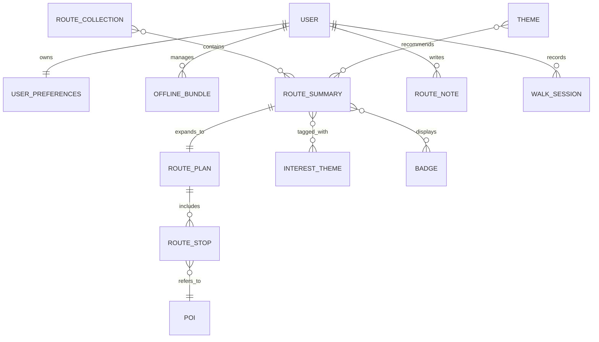

# Wildside mockup data model (backend-compatible)

Last updated: 13 December 2025

## Purpose

The Wildside front-end mockup currently renders its screens from hard-coded
fixtures under `src/app/data/` (for example, Explore route cards, offline
download cards, safety toggles, and map route summaries).

This document specifies a **backend-compatible data model** for those fixtures
so that:

- The mockup can evolve from “fixtures in TypeScript” to “data from the
  Wildside backend” without rewriting the UI.
- The proposed Wildside backend (a hexagonal, modular monolith) can support the
  same entity shapes through explicit domain boundaries, ports, and adapters.
- The offline-first and local-first behaviours described in the documentation
  remain first-class (fast reads, offline mutation queuing, and offline map
  bundles).

This is intentionally a design document, not an implementation plan.

## Scope and non-goals

In scope:

- Entity and value-object schemas that cover the mockup’s fixture-driven flows:
  Explore, Discover, Customize, Map, Safety, Offline downloads, and Walk
  completion.
- How those entities map onto the backend’s hexagonal architecture (domain
  modules, ports, and inbound/outbound adapters).
- A persistence-oriented view (PostgreSQL/PostGIS on the backend, IndexedDB via
  TanStack Query persistence and Dexie/Cache Storage on the frontend).

Out of scope:

- Full route-generation engine design (scoring, optimization, enrichment).
- Exact PostGIS table layouts for Martin tiles beyond what the mockup requires.
- Multi-writer conflict-free replicated data types (CRDTs). The model remains
  compatible with later upgrades, but does not require them for MVP.

## Constraints derived from the existing docs

The following constraints are carried over from the existing documentation:

- **Hexagonal backend:** domain types must be valid and complete without
  framework dependencies; adapters translate at the boundary and do not invent
  domain state.
- **Local-first React:** treat domain data as server state, but persist it
  locally and render from the local copy first; treat the network as optional.
- **Offline-first assets:** offline bundles are first-class entities, but the
  tile bytes themselves are stored outside React state (Cache Storage or Dexie
  keyed by bundle metadata).
- **Dexie’s role:** Dexie (or Cache Storage) is a durable storage engine for
  heavy/binary assets and an outbox, not a sync worldview.

## Model layering

To keep both the backend and the client predictable, the model is separated
into four layers:

1. **Descriptors (small, stable registries):** bounded vocabularies such as
   difficulties, safety toggles, and tags.
2. **Catalogue (public, read-mostly):** Explore’s categories, themes,
   collections, and curated routes.
3. **Generated routes (per request):** route plans produced by the route
   engine (geometry + ordered stops).
4. **User state (write-heavy):** interests, saved routes, notes, walk progress,
   offline bundles, and completion summaries.

The mockup renders cards from projections over these layers.

## Shared primitives (backend and frontend)

### Identifiers

Use universally unique identifiers (UUIDs) for entities that can be created on
the client while offline:

- Notes, favourites, offline bundles, and walk sessions use client-generated
  UUIDs (prefer UUIDv7) so they can be created offline without coordination.
- Server-generated identifiers (route requests, internal jobs) are also UUIDs.

Where humans benefit from stable, readable references, include an optional
`slug` or `code` field alongside the UUID:

- `id` is the stable primary key.
- `slug` is a stable, unique-per-type string for deep links, analytics labels,
  and debugging. It must never be used as an integrity key.

### Time and versions

All timestamps are International Organization for Standardization (ISO) 8601
Coordinated Universal Time (UTC) on the wire.

For user-authored content, include an integer `revision` (or `etag`) for
optimistic concurrency. The mockup can ignore this initially, but it provides a
clean upgrade path for multi-device consistency.

### Units

Store numeric quantities in International System of Units (SI) base units in
all persisted models:

- Distances in metres.
- Durations in seconds.
- Areas as bounding boxes in World Geodetic System 1984 (WGS84) coordinates.
- Byte sizes as integers.

### Localization

To align with the mockup’s current `EntityLocalizations`, use a map keyed by a
restricted set of locale codes:

```ts
type LocaleCode = string;

type LocalizedStringSet = {
  readonly name: string;
  readonly shortLabel?: string;
  readonly description?: string;
};

type EntityLocalizations = Record<LocaleCode, LocalizedStringSet>;
```

Backend persistence can store this as a `jsonb` column per entity or as a
separate translation table. The on-wire shape remains stable either way.

### Media

Use a small, explicit media object rather than raw strings:

```ts
type ImageAsset = {
  readonly url: string;
  readonly alt: string;
};
```

## Descriptors

Descriptors are small vocabularies that the UI uses everywhere. They should be
available offline and versioned slowly.

### Difficulty

Difficulty is a bounded set and can remain a string code in the domain:

```ts
type DifficultyCode = "easy" | "moderate" | "challenging";
```

### Badge, tag, and interest theme

Interests, tags, and badges are better modelled as catalogue entities because
they will grow and can be localized.

```ts
type InterestTheme = {
  readonly id: string; // UUID
  readonly slug: string;
  readonly localizations: EntityLocalizations;
  readonly iconKey: string;
};

type Tag = {
  readonly id: string; // UUID
  readonly slug: string;
  readonly localizations: EntityLocalizations;
};

type Badge = {
  readonly id: string; // UUID
  readonly slug: string;
  readonly localizations: EntityLocalizations;
};
```

`iconKey` is a semantic identifier (for example, `category:nature`) that the
client maps to its design tokens. The backend must not store Tailwind class
strings.

### Safety toggles and presets

Safety toggles behave like a descriptor registry plus user selections:

```ts
type SafetyToggle = {
  readonly id: string; // UUID
  readonly slug: string;
  readonly localizations: EntityLocalizations;
  readonly iconKey: string;
  readonly defaultEnabled: boolean;
};

type SafetyPreset = {
  readonly id: string; // UUID
  readonly slug: string;
  readonly localizations: EntityLocalizations;
  readonly iconKey: string;
  readonly appliedToggleIds: readonly string[];
};
```

## Catalogue (Explore and Discover)

The Explore screen uses catalogue entities that are:

- Public (can be fetched without a session).
- Read-mostly (updated by ingestion/curation jobs rather than by users).
- Cacheable (ideal for long-lived client-side caches and offline usage).

### Route summary (card-level projection)

The Explore cards only need a lightweight projection of a route, not the full
route plan:

```ts
type RouteSummary = {
  readonly id: string; // UUID
  readonly slug?: string;
  readonly localizations: EntityLocalizations;
  readonly heroImage: ImageAsset;
  readonly distanceMetres: number;
  readonly durationSeconds: number;
  readonly rating: number;
  readonly badgeIds: readonly string[];
  readonly difficulty: DifficultyCode;
  readonly interestThemeIds: readonly string[];
};
```

This maps directly onto the mockup’s `Route` fixture type in
`src/app/data/explore.models.ts`, replacing string codes with UUID references
while preserving presentation needs.

### Route category, theme, and collection

Categories and themes are “ways to browse” routes.

```ts
type RouteCategory = {
  readonly id: string; // UUID
  readonly slug: string;
  readonly localizations: EntityLocalizations;
  readonly routeCount: number;
  readonly iconKey: string;
};

type Theme = {
  readonly id: string; // UUID
  readonly slug: string;
  readonly localizations: EntityLocalizations;
  readonly image: ImageAsset;
  readonly walkCount: number;
  readonly distanceRangeMetres: readonly [number, number];
  readonly rating: number;
};

type RouteCollection = {
  readonly id: string; // UUID
  readonly slug: string;
  readonly localizations: EntityLocalizations;
  readonly leadImage: ImageAsset;
  readonly mapPreview: ImageAsset;
  readonly distanceRangeMetres: readonly [number, number];
  readonly durationRangeSeconds: readonly [number, number];
  readonly difficulty: DifficultyCode;
  readonly routeIds: readonly string[];
};
```

### Trending and community picks

These are catalogue “curation overlays” rather than properties of a route:

```ts
type TrendingRouteHighlight = {
  readonly routeId: string; // RouteSummary.id
  readonly trendDelta: string;
  readonly subtitleLocalizations: EntityLocalizations;
};

type CommunityPick = {
  readonly id: string; // UUID
  readonly localizations: EntityLocalizations;
  readonly curator: {
    readonly displayName: string;
    readonly avatar: ImageAsset;
  };
  readonly rating: number;
  readonly distanceMetres: number;
  readonly durationSeconds: number;
  readonly saves: number;
  readonly routeId?: string;
};
```

`routeId` allows a community pick to resolve to a real route when available,
while keeping the UI functional when the pick is editorial content.

### Catalogue snapshot API

To keep the mockup fast and offline-friendly, expose a single “Explore
snapshot” endpoint that returns all catalogue entities needed for the screen:

```ts
type ExploreCatalogueSnapshot = {
  readonly generatedAt: string; // ISO 8601
  readonly categories: readonly RouteCategory[];
  readonly routes: readonly RouteSummary[];
  readonly themes: readonly Theme[];
  readonly collections: readonly RouteCollection[];
  readonly trending: readonly TrendingRouteHighlight[];
  readonly communityPick: CommunityPick | null;
};
```

The client can persist this response and hydrate the Explore UI without further
calls.

## Generated routes (Map and Wizard)

Route generation produces a **route plan** that is heavier than a route card.

The backend architecture already models route generation as:

- A request (`POST /api/v1/routes`) that enqueues a job and returns a
  `requestId`.
- A status poll (`GET /api/v1/routes/{requestId}`) and/or WebSocket progress
  events.

To support Map and Walk completion screens, the final route object needs:

- A stable `routeId`.
- Geometry (polyline/LineString) suitable for tile rendering.
- An ordered list of stops which refer to points of interest (POIs).

```ts
type GeoPoint = {
  readonly type: "Point";
  readonly coordinates: readonly [number, number];
};

type GeoLineString = {
  readonly type: "LineString";
  readonly coordinates: readonly [number, number][];
};

type PointOfInterest = {
  readonly id: string; // UUID (or "osm:<type>:<id>" if keeping source IDs)
  readonly localizations: EntityLocalizations;
  readonly categoryTagId: string;
  readonly tagIds: readonly string[];
  readonly rating?: number;
  readonly image?: ImageAsset;
  readonly openHours?: { readonly opensAt: string; readonly closesAt: string };
  readonly location: GeoPoint;
};

type RouteStop = {
  readonly id: string; // UUID
  readonly position: number; // 0-based ordering
  readonly poiId: string;
  readonly note?: string;
};

type RoutePlan = {
  readonly id: string; // UUID
  readonly summary: RouteSummary;
  readonly geometry: GeoLineString;
  readonly stops: readonly RouteStop[];
  readonly pois: readonly PointOfInterest[]; // included for offline friendliness
  readonly createdAt: string;
};
```

Including the referenced POIs inline in the route plan makes offline usage far
simpler: the app can persist one object and render Map/Stops without a second
lookup layer.

## User state (local-first and syncable)

User state should be writable offline and synchronized opportunistically.

### User profile and preferences

User preferences act as a compact aggregate:

```ts
type UserPreferences = {
  readonly userId: string;
  readonly interestThemeIds: readonly string[];
  readonly safetyToggleIds: readonly string[];
  readonly unitSystem: "metric" | "imperial";
  readonly revision: number;
  readonly updatedAt: string;
};
```

### Notes, favourites, and progress

Notes and route progress are user-authored and must support offline creation.

```ts
type RouteNote = {
  readonly id: string; // UUID (client-generated)
  readonly routeId: string;
  readonly poiId?: string;
  readonly body: string;
  readonly createdAt: string;
  readonly updatedAt: string;
  readonly revision: number;
};

type RouteProgress = {
  readonly routeId: string;
  readonly visitedStopIds: readonly string[];
  readonly updatedAt: string;
  readonly revision: number;
};
```

### Walk session and completion

Walk completion in the mockup is modelled as “stats + favourite moments”. In a
backend-compatible model, that is derived from a persisted walk session:

```ts
type WalkSession = {
  readonly id: string; // UUID (client-generated)
  readonly routeId: string;
  readonly startedAt: string;
  readonly endedAt?: string;
  readonly primaryStats: ReadonlyArray<{
    readonly kind: "distance" | "duration";
    readonly value: number;
  }>;
  readonly secondaryStats: ReadonlyArray<{
    readonly kind: "energy" | "count";
    readonly value: number;
    readonly unit?: string;
  }>;
  readonly highlightedPoiIds: readonly string[];
};
```

The client can render the Walk completion screen directly from `WalkSession`,
optionally denormalizing a small “moment” projection from the POIs referenced.

## Offline bundles

Offline bundles are the bridge between “catalogue JSON” and “tile bytes”.

### Offline bundle manifest

The app should persist a bundle manifest as normal data (query cache / Dexie),
while storing bytes elsewhere (Cache Storage or Dexie blobs).

```ts
// [minLng, minLat, maxLng, maxLat]
type BoundingBox = readonly [number, number, number, number];

type OfflineBundle = {
  readonly id: string; // UUID (client-generated)
  readonly ownerUserId?: string;
  readonly kind: "region" | "route";
  readonly routeId?: string;
  readonly regionId?: string;
  readonly bounds: BoundingBox;
  readonly zoomRange: readonly [number, number];
  readonly estimatedSizeBytes: number;
  readonly createdAt: string;
  readonly updatedAt: string;
  readonly status: "queued" | "downloading" | "complete" | "failed";
  readonly progress: number; // 0..1
};
```

The mockup’s `OfflineMapArea` fixture maps cleanly onto `OfflineBundle` with a
`kind: "region"` and a localized display name drawn from either the region
catalogue entity or a client label.

### Tile storage

Two storage strategies remain compatible with this data model:

- **Service Worker + Cache Storage:** tile URLs are cached under their normal
  request URLs; `OfflineBundle` stores the bounds/zoom range needed to
  reconstruct the URL set.
- **Dexie tile table:** tile blobs are stored by compound key
  `{bundleId, z, x, y}`, allowing explicit eviction and accounting.

The backend does not need to store tile bytes, but it can provide:

- Tile base URLs and style metadata.
- Optional region catalogues with recommended bounds/zoom defaults.

### Outbox (offline mutations)

To synchronize offline writes (notes, favourites, preferences, bundle creates
and deletes), store an explicit outbox table in Dexie:

```ts
type OutboxItem = {
  readonly id: string; // UUID (client-generated)
  readonly type: string;
  readonly aggregateId: string;
  readonly payload: unknown;
  readonly createdAt: string;
  readonly lastAttemptAt?: string;
  readonly status: "pending" | "inFlight" | "failed";
};
```

Outbound HTTP writes include an `Idempotency-Key` set to `OutboxItem.id` so the
backend can deduplicate retries safely.

## How the backend hexagon supports this model

The backend’s hexagonal architecture supports the above model by grouping
entities into domain modules and exposing them through port traits.

### Suggested domain modules

- `domain::catalogue`: route summaries, categories, collections, themes,
  descriptors (interests, tags, badges).
- `domain::routing`: route requests, route plans, stops, and POI projections.
- `domain::user`: user profile and preferences.
- `domain::annotations`: route notes, favourites, and progress.
- `domain::offline`: offline bundle manifests (not tile bytes).

### Suggested driven ports (repositories/services)

- `CatalogueRepository` (read): fetch Explore snapshots and descriptor sets.
- `RouteRepository` (read/write): store and load generated routes and route
  request statuses.
- `PoiRepository` (read): load POIs for route plans and tiles.
- `UserRepository` (read/write): user profile and session ownership.
- `UserPreferencesRepository` (read/write): interests and safety settings with
  optimistic concurrency.
- `RouteAnnotationRepository` (read/write): notes, favourites, and progress.
- `OfflineBundleRepository` (read/write): bundle manifests per user/device.

Outbound adapters implement these ports with PostgreSQL/PostGIS and Redis (for
cache and job coordination). Inbound adapters map JSON payloads into validated
domain types and never construct domain objects directly.

### Suggested inbound API endpoints

The following endpoint set is sufficient to back the mockup’s current screens:

- `GET /api/v1/catalogue/explore` → `ExploreCatalogueSnapshot`
- `GET /api/v1/interest-themes` → `InterestTheme[]`
- `PUT /api/v1/users/me/preferences` → `UserPreferences`
- `POST /api/v1/routes` → `{ requestId }` (already documented)
- `GET /api/v1/routes/{requestId}` → `{ status, routeId?, routePlan? }`
- `GET /api/v1/routes/{routeId}` → `RoutePlan`
- `GET /api/v1/routes/{routeId}/annotations` → notes + progress
- `POST /api/v1/routes/{routeId}/notes` → create/update note (idempotent)
- `PUT /api/v1/routes/{routeId}/progress` → progress (idempotent)
- `GET /api/v1/offline/bundles` → `OfflineBundle[]`
- `POST /api/v1/offline/bundles` → create bundle (idempotent)
- `DELETE /api/v1/offline/bundles/{bundleId}` → delete bundle

This keeps the UI data-driven while remaining compatible with the backend’s
existing route-generation flow and error envelope.

## Frontend persistence (TanStack Query + Dexie)

The client-side storage strategy implied by this model is:

- Persist the TanStack Query cache (catalogue snapshots, routes, POIs, notes)
  into IndexedDB.
- Use Dexie (or Cache Storage) for heavy tile bytes and for an explicit outbox.

A minimal Dexie schema for Wildside’s mockup needs:

```ts
db.version(1).stores({
  outbox: "id,type,aggregateId,status,createdAt",
  offlineBundles: "id,kind,status,updatedAt,routeId,regionId",
  tiles: "[bundleId+z+x+y],bundleId,z,x,y",
});
```

## Relationship sketch

The following entity relationship diagram illustrates the core relationships
the backend must support to hydrate the mockup.



## Cross-document links

- Card-level entity schemas and localization rules:
  `docs/data-model-driven-card-architecture.md`.
- Mockup migration notes and the current fixture layout:
  `docs/wildside-mockup-design.md`.
